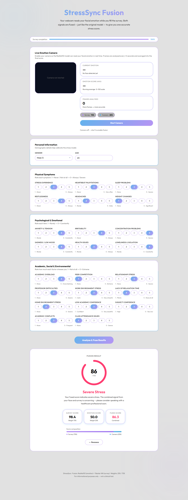

# StressSync

This repository contains a **Student Stress Detection System** that combines real-time facial emotion recognition (pictorial data) with an interactive survey (tabular data) to predict stress levels. It supports both a local command-line interface with a CV2 camera window and a full-featured modern web application interface.

## 🚀 Features

- **Real-Time Facial Expression Analysis:** Uses a ResNet-50 model trained on the RAF-DB dataset to detect faces and classify facial expressions at runtime (running on CPU or CUDA).
- **Survey-Based Stress Assessment:** Uses a PyTorch Neural Network trained on a student stress dataset to classify stress indicators from survey responses.
- **Weighted Fusion Engine:** Combines facial expression scores (25% weight) and tabular survey scores (75% weight) dynamically to output a robust fused stress score categorized from *Low* to *Severe*.
- **Interactive Web Interface:** A premium, modern web dashboard with live camera feed, real-time analytics graphs, responsive survey form, and clean status indicators.
- **CLI/GUI Application:** A quick-run Python script that displays a local CV2 window overlaying face rectangles, labels, and real-time stress levels.
---

## 📷 Screenshots


---

## 📁 Project Structure

```
├── .gitattributes             
├── .gitignore                 
├── app.py                     
├── best_rafdb_resnet50.pth    
├── fusion.py                  
├── requirements.txt           
├── student_stress_model.pth   
└── static/
    └── index.html             
```
*\* Note: Large model files are ignored by `.gitignore` by default to prevent repository bloat.*

---

## 🛠️ Installation & Setup

### 1. Clone the repository
```bash
git clone https://github.com/Iman826/StressSync.git
```

### 2. Set up a virtual environment (Recommended)
```bash
# Windows
python -m venv venv
venv\Scripts\activate

# macOS/Linux
python3 -m venv venv
source venv/bin/activate
```

### 3. Install Dependencies
```bash
pip install -r requirements.txt
```
*Note: If you have a CUDA-enabled GPU and want to run predictions on hardware acceleration, install PyTorch with CUDA support matching your system configurations from [pytorch.org](https://pytorch.org/).*

---

## 💻 Running the App

### Option A: The Web Dashboard (Recommended)
Launch the Flask web server:
```bash
python app.py
```
Open your browser and navigate to:
```
http://localhost:5000
```
- Click **Start Camera** to begin the live emotion analyzer.
- Fill out the survey form.
- Click **Calculate Fused Stress Score** to view the combined analytics and diagnostic charts.

### Option B: Local CLI & OpenCV Window
Run the standalone fusion script:
```bash
python fusion.py
```
- A window will pop up showing your webcam feed with face bounding boxes and current emotion labels.
- Go to the terminal/command line and answer the survey questions.
- Once completed, the camera window will overlay your real-time fused stress score.
- Press **Q** on the camera window to exit.

## 📊 Dataset Citation & License

### 1. Tabular Dataset (Stress Indicators)
The survey assessment model is trained on the **Stress Indicators Dataset for Mental Health Classification** published on Mendeley Data.

*   **Citation:** 
    > Mondol, Md Mahabub Rana; Kabir, Md Alamgir (2023), “Stress Indicators Dataset for Mental Health Classification”, Mendeley Data, V2, doi: 10.17632/2gsjv8m7ch.2
*   **Original Source:** [Mendeley Data Repository](https://data.mendeley.com/datasets/2gsjv8m7ch/2)
*   **License:** [CC BY 4.0 (Creative Commons Attribution 4.0 International)](https://creativecommons.org/licenses/by/4.0/)

### 2. Pictorial Dataset (RAF-DB Emotion Model)
The real-time facial expression ResNet-50 model is trained on the **Real-world Affective Faces Database (RAF-DB)**.

*   **Citation:** 
    > Li, Shan, Weihong Deng, and JunPing Du. "Reliable crowdsourcing and deep locality-preserving learning for expression recognition in the wild." Proceedings of the IEEE Conference on Computer Vision and Pattern Recognition (CVPR). 2017.
*   **Original Source:** [Real-world Affective Faces Database (RAF-DB)](http://www.whdeng.cn/RAF/model1.html)
*   **License:** Non-commercial research use only.
